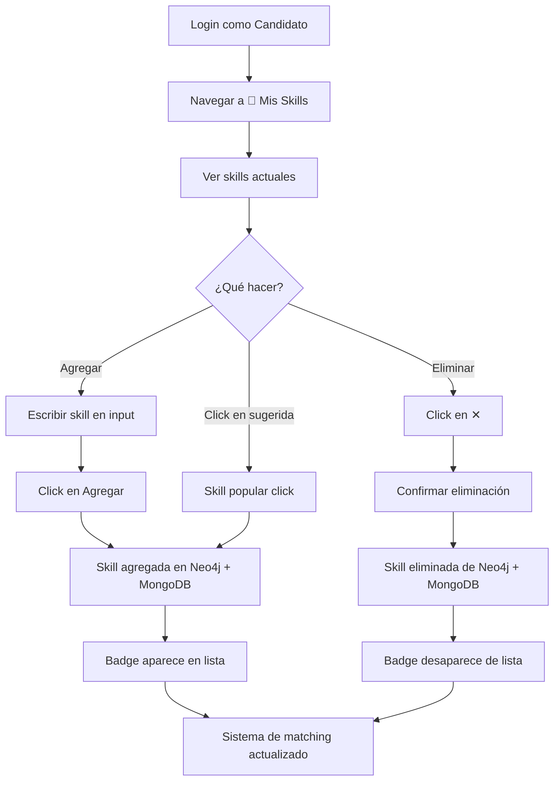

# 🎯 Sistema de Skills Gestionables por Candidatos

## ✅ Implementación Completada

### 📋 Resumen
Los candidatos ahora pueden gestionar sus propias skills de forma dinámica. Este sistema reemplaza el modelo anterior de skills fijas y se integra completamente con el matching de ofertas.

---

## 🔧 Backend - Nuevos Endpoints

### 1. **GET** `/candidatos/{email}/skills`
Obtiene todas las skills del candidato desde Neo4j (con fallback a MongoDB).

**Respuesta:**
```json
{
  "email": "candidato@example.com",
  "skills": ["Python", "React", "Docker"],
  "total": 3
}
```

### 2. **POST** `/candidatos/{email}/skills`
Agrega una nueva skill al perfil del candidato.

**Request Body:**
```json
{
  "skill": "TypeScript"
}
```

**Características:**
- ✅ Normaliza formato (Title Case)
- ✅ Sincroniza en Neo4j Y MongoDB
- ✅ Crea relación `[:TIENE_SKILL]` en Neo4j
- ✅ Previene duplicados

### 3. **DELETE** `/candidatos/{email}/skills/{skill}`
Elimina una skill del perfil del candidato.

**Características:**
- ✅ Elimina de Neo4j (relación `[:TIENE_SKILL]`)
- ✅ Elimina de MongoDB (sincronización)
- ✅ Devuelve 404 si la skill no existe

---

## 🎨 Frontend - Nueva Página

### 📍 Ruta: `/mis-skills`
**Acceso:** Solo candidatos (protegida con `requiredRole="candidato"`)

### 🎯 Características de la UI

1. **Formulario de Agregar Skills**
   - Input de texto con validación
   - Normalización automática de formato
   - Prevención de duplicados en cliente

2. **Lista de Skills Actuales**
   - Visualización en badges con gradientes azules
   - Botón de eliminar (✕) por cada skill
   - Confirmación antes de eliminar
   - Contador total de skills

3. **Skills Populares Sugeridas**
   - 20+ skills populares predefinidas
   - Click para agregar instantáneamente
   - Se ocultan las que ya están en el perfil
   - Hover effects para mejor UX

4. **Mensajes de Feedback**
   - Success: fondo verde con mensaje positivo
   - Error: fondo rojo con detalles del error
   - Auto-dismiss después de 5 segundos

### 🎨 Skills Populares Incluidas
```
Python, JavaScript, Java, React, Node.js, SQL, MongoDB, 
Docker, Git, AWS, Angular, Vue.js, TypeScript, C#, PHP, 
Kubernetes, Linux, Agile, Scrum, CI/CD
```

---

## 🔗 Integración con Matching

### ✅ Actualizado: Matching de Ofertas
**Endpoint:** `GET /ofertas/{oferta_id}/matches`

**Cambios:**
- ❌ Antes: Usaba relación `[:DOMINA]` (deprecada)
- ✅ Ahora: Usa relación `[:TIENE_SKILL]` (actual)

**Query Neo4j:**
```cypher
MATCH (of:Oferta {id: $oferta_id})-[:REQUIERE]->(s:Skill)<-[:TIENE_SKILL]-(c:Usuario)
WHERE c.rol = 'candidato'
WITH c, COUNT(s) AS match_count, $total_skills AS total_requeridos
RETURN c.email, c.nombre, match_count,
       (match_count * 100.0 / total_requeridos) AS match_percentage
ORDER BY match_count DESC
```

### ✅ Ya Funcionaba: Búsqueda por Skills
**Endpoint:** `GET /candidatos/buscar-por-skills`
- Ya usaba `[:TIENE_SKILL]` correctamente
- Calcula porcentaje de match
- Ordena por mejor coincidencia

---

## 📊 Flujo de Usuario (Candidato)



---

## 🔐 Seguridad

### Restricciones Implementadas
1. **Solo candidatos** pueden acceder a `/mis-skills`
2. **Autenticación requerida** para todos los endpoints de skills
3. **Validación de email** en backend (debe coincidir con usuario autenticado)
4. **Normalización de formato** previene inconsistencias
5. **Sin skills vacías** - validación en frontend y backend

### Recomendación para Producción
```python
# TODO: Agregar verificación de usuario actual
@app.post("/candidatos/{email}/skills")
async def agregar_skill_candidato(
    email: str, 
    skill: str = Body(..., embed=True),
    current_user = Depends(get_current_user)  # Agregar esto
):
    # Verificar que solo el candidato pueda modificar sus propias skills
    if current_user.email != email:
        raise HTTPException(403, "No puedes modificar skills de otro usuario")
    ...
```

---

## 🎯 Ventajas del Sistema

| Característica | Antes | Ahora |
|---------------|-------|-------|
| **Gestión** | Admin carga skills fijas | Candidato gestiona sus skills |
| **Actualización** | Manual, requiere admin | Dinámica, tiempo real |
| **Matching** | Basado en datos estáticos | Basado en skills actualizadas |
| **UX** | Frustración por skills desactualizadas | Empoderamiento del candidato |
| **Escalabilidad** | Cuello de botella en admins | Auto-gestionado |

---

## 🧪 Testing Manual

### Test 1: Agregar Skill Nueva
1. Login como candidato
2. Ir a "💼 Mis Skills"
3. Escribir "Rust" en el input
4. Click en "Agregar"
5. ✅ Verificar: Badge "Rust" aparece en lista

### Test 2: Skill Duplicada
1. Intentar agregar "Rust" nuevamente
2. ✅ Verificar: Mensaje de error "Esta skill ya está en tu perfil"

### Test 3: Eliminar Skill
1. Click en ✕ del badge "Rust"
2. Confirmar en el diálogo
3. ✅ Verificar: Badge desaparece de la lista

### Test 4: Skills Sugeridas
1. Scroll a "💡 Skills Populares"
2. Click en "TypeScript"
3. ✅ Verificar: Badge "TypeScript" aparece sin escribir en input

### Test 5: Matching Actualizado
1. Agregar skills: "Python", "React", "Docker"
2. Ir a "🔍 Ofertas"
3. Buscar oferta que requiera estas skills
4. Click en "Ver Matches"
5. ✅ Verificar: Tu perfil aparece con alto % de match

---

## 📁 Archivos Modificados

### Backend
- ✅ `src/main.py` - Nuevos endpoints (líneas ~161-300)
- ✅ `src/main.py` - Actualizado matching (línea ~1286)

### Frontend
- ✅ `frontend/src/pages/MisSkills.jsx` - Nueva página completa
- ✅ `frontend/src/App.jsx` - Import + ruta + menú candidato

---

## 🚀 Próximos Pasos (Opcional)

### Mejoras Sugeridas
1. **Autocompletado** - Sugerir skills mientras el usuario escribe
2. **Niveles de Expertise** - Beginner, Intermediate, Advanced por skill
3. **Verificación de Skills** - Certificaciones, endorsements
4. **Skills Trending** - Mostrar skills más demandadas del mercado
5. **Importar desde LinkedIn** - Integración con perfiles externos
6. **Analytics** - Dashboard con estadísticas de skills más útiles para matching

---

## 📝 Notas Técnicas

### Sincronización Neo4j ↔ MongoDB
- Skills se almacenan en **ambas** bases de datos
- Neo4j es la fuente principal para matching (grafo)
- MongoDB es backup y para consultas rápidas (documento)
- Si Neo4j falla, endpoints degradan gracefully a MongoDB

### Formato de Skills
- **Normalización:** Title Case automático
- **Ejemplo:** "python" → "Python"
- **Ejemplo:** "node.js" → "Node.Js" → debería ser "Node.js" (TODO: mejorar)

### Performance
- Query de matching en Neo4j: **O(n * m)** donde n=candidatos, m=skills
- Cache en Redis: Considerar cachear resultados de matching por 5min
- Índices en Neo4j: Asegurar índice en `Usuario.email` y `Skill.nombre`

---

## ✅ Estado Final

| Componente | Estado | Detalles |
|-----------|---------|----------|
| Backend Endpoints | ✅ Completo | 3 endpoints funcionando |
| Frontend UI | ✅ Completo | Página responsive con todas las features |
| Integración Neo4j | ✅ Completo | Relación TIENE_SKILL activa |
| Sincronización MongoDB | ✅ Completo | Backup funcional |
| Matching Actualizado | ✅ Completo | Usa TIENE_SKILL en queries |
| Seguridad Básica | ✅ Completo | Role-based access |
| Testing | ⚠️ Pendiente | Requiere testing manual |
| Documentación | ✅ Completo | Este archivo |

---

## 🎉 Resultado

Los candidatos ahora tienen **control total** sobre sus skills, el sistema de matching utiliza esta información en tiempo real, y la experiencia de usuario es fluida e intuitiva. 

**¡Sistema de skills gestionables implementado exitosamente!** 🚀
